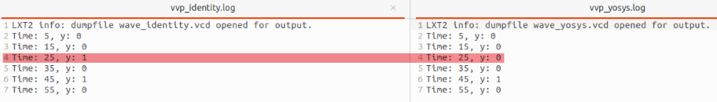

## 	Abnormal Output from Yosys Synthesis

Version
Yosys 0.39+165

On which OS did this happen?
Linux

Reproduction Steps

Considering the following code (I have tried my best to minimize test cases)
```
module top  (y, clk, wire0);

output wire y;
input wire clk;
input wire [2:0] wire0;

reg reg264 = 1'b0;
reg [2:0] reg274 = 3'b000;

wire [2:0] wire6;
wire wire4;
reg reg278 = 1'b0;

assign y = reg278;
assign wire4 = (8'ha6 > wire0) <= wire0[0];
assign wire6 = {2'b0, wire4};

  always
    @(posedge clk) 
    begin
      reg274 <= wire0[(1'h1):(1'h1)];
      if ({$unsigned((wire0 >> wire6))})
        begin
        end
      else
        begin
          reg278 = $unsigned(({reg274} > $unsigned(reg264)));
        end
    end
  
endmodule
```



Consistent output before and after synthesis
I also conducted the above test using Vivado and it did not encounter this issue
